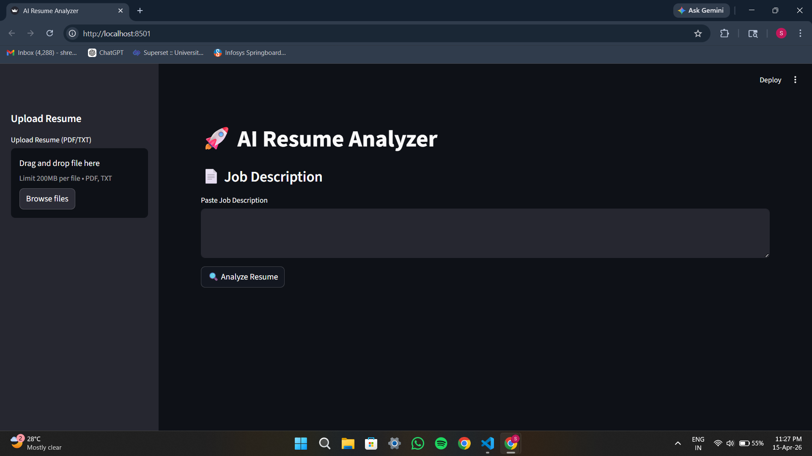
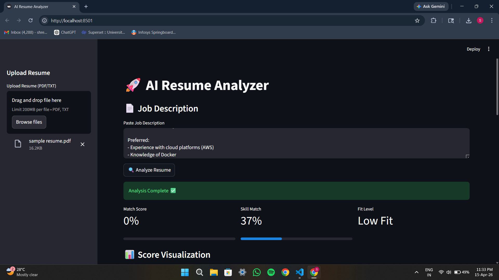

# 🚀 AI Resume Analyzer (LLM-Based)

An AI-powered Resume Analyzer that compares resumes with job descriptions and generates match score, strengths, weaknesses, missing skills, and improvement suggestions using a local LLM.

---

## 🔥 Features

- 📄 Upload Resume (PDF/TXT)
- 📝 Paste Job Description
- 🤖 AI-based Resume Analysis using Ollama
- 📊 Match Score & Skill Match %
- ✅ Strengths & ❌ Weaknesses Detection
- 💡 Suggestions for improvement
- 📥 Downloadable JSON report
- 📈 Visualization using charts
- 🧠 Skill matching logic

---

## 🧠 Tech Stack

- Python
- Streamlit
- Ollama (tinyllama)
- PyPDF2
- Pydantic
- Matplotlib

---

## 📸 Screenshots

### 🖥️ Application UI


### 📊 Analysis Output


---

## ⚙️ How to Run

### 1. Clone Repository

```bash
git clone https://github.com/YOUR-USERNAME/ai-resume-jd-matcher.git
cd ai-resume-jd-matcher
```

### 2. Create Virtual Environment

```bash
python -m venv venv
venv\Scripts\activate
```

### 3. Install Requirements

```bash
pip install -r requirements.txt
```

### 4. Run Ollama

```bash
ollama run tinyllama
```

### 5. Run Application

```bash
streamlit run streamlit_app.py
```

---

## 📊 Sample Output

```json
{
  "match_score": 80,
  "strengths": [
    "Strong Python skills",
    "Experience with REST APIs"
  ],
  "weaknesses": [
    "No cloud platform experience"
  ],
  "suggestions": [
    "Learn AWS or GCP basics",
    "Build more backend projects"
  ],
  "fit_label": "Good Fit"
}
```

---

## 👨‍💻 Author

Shreyas K N
